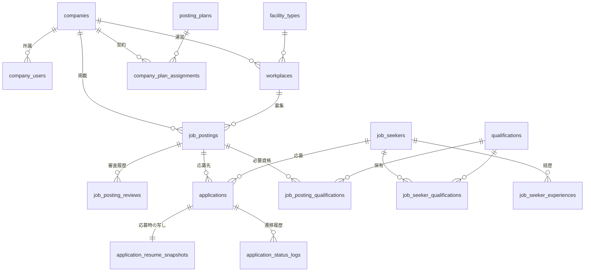

# SPEC.md — 介護・医療・福祉特化 求人メディア構築パッケージ 仕様書

> 最終更新: 2026-07-30
> ステータス: 第1リリース向け仕様確定

---

## 1. 製品概要とビジネスモデル

### 1.1 何を作るのか

**介護・医療・福祉に特化した「求人メディアを立ち上げるためのパッケージ」** を自社開発し、導入支援とセットで販売する。

顧客は「介護業界の求人サイトを運営したい事業者」であり、求職者でも介護事業者でもない。顧客がこのパッケージを導入すると、複数の介護事業者の求人が掲載される求人メディアが立ち上がる。

```
[あなた] ── パッケージ + 導入支援 ──▶ [顧客: メディア運営者]
                                          例) 介護業界団体
                                              介護特化の人材・派遣会社
                                              地域の求人メディア事業者
                                              │
                                              │ 掲載枠を販売
                                              ▼
                                         [掲載企業: 介護事業所]
                                              │ 求人を掲載
                                              ▼
                                         [求職者] ── 応募 ──▶ 掲載企業
```

### 1.2 参考にしている製品

[jobMAKER(株式会社プロシーズ)](https://jobmaker.jp/) と同じ製品カテゴリ。jobMAKER は初期費用 50〜150万円 + 月額 5〜10万円で、700サイト以上の構築実績を持つ求人サイト構築 ASP。

**本製品の差別化**: jobMAKER は業界を問わない汎用パッケージ。本製品は**介護・医療・福祉に特化**し、資格・施設形態・職種のマスタと入力体験をこの領域に最適化することで、導入時の設定工数と原稿作成の負担を下げる。

### 1.3 収益モデル

| 項目 | 内容 |
|---|---|
| 初期費用 | 50〜150万円。導入支援(ヒアリング・初期設定・データ移行・操作研修)を含む |
| 初期費用の差 | **掲載上限・機能プランの差**。個別の機能開発は含まない |
| 月額 | 5〜10万円。システム利用料 + サーバ運用 + 保守 |
| デザイン | **別料金で個別制作**(テーマとして実装) |
| 掲載料の集金 | 顧客が掲載企業から集金する。**システムは関与しない** |

### 1.4 お金の流れは 2 重になる

```
あなた ──[初期費用 + 月額]──▶ 顧客(メディア運営者)  ← システム外(請求書)
顧客   ──[掲載料]◀────────── 掲載企業               ← システムは「プラン定義と掲載制限」まで
```

**システムが担うのは掲載プランの定義と掲載件数の制限まで**。請求書発行も決済も行わない。集金方法は顧客ごとに商習慣が違い、システム化するとかえって使いづらくなるため。

---

## 2. 決定の変遷と根拠

**後日「なぜこうなっているのか」を思い出すためのセクション。** 実装の根拠でもある。

### 2.1 【最重要】自社SaaS運営 → パッケージ販売への転換

当初は「介護事業者に月額1〜3万円で自社採用サイトを提供するマルチテナントSaaS」として仕様化していた。ヒアリングの結果、目指しているのは jobMAKER 型のパッケージ販売であると判明し、**前回の仕様は全面的に破棄**した。

| 論点 | 旧仕様(破棄) | 現仕様 |
|---|---|---|
| 作るもの | 自社採用サイト + ATS | 求人メディア構築パッケージ |
| 顧客 | 介護事業者 | 求人メディアを立ち上げたい事業者 |
| 価格 | 月額1〜3万・初期0円 | 初期50〜150万 + 月額5〜10万 |
| 配置 | 1システムに全顧客 | 顧客ごとに独立環境 |
| 集客 | 顧客の責任・フィード見送り | アグリゲーション連携が中核 |
| 法令チェック | 掲載企業の責任 | 運営者による審査フロー |

### 2.2 マルチテナント → 顧客ごとに独立環境

顧客ごとに Xserver を 1 契約し、完全に独立した環境を払い出す。

**この判断の帰結として、テナント分離の仕組みが丸ごと不要になった。** 旧仕様で最重要としていた `tenant_id`・Global Scope・`BelongsToTenant`・分離テストは**一切作らない**。1環境 = 1メディアであり、DB の中に他社のデータは存在しない。

| 独立環境の利点 | 代償 |
|---|---|
| 障害が他顧客に波及しない | 顧客数だけ環境が増える |
| 「専用環境です」と言える | コード更新を全環境に配る仕組みが必須 |
| 解約時にデータ一式を渡せる | サーバ費が顧客数に比例(月額5〜10万に対し月千円台なので許容) |
| データモデルが単純になる | 環境ごとのバージョン差を管理する必要がある |

### 2.3 コードは 1 本、差は「設定・DB・テーマ」だけ

顧客ごとに環境が分かれても、**コードベースは 1 本に保つ**。git で全環境へ配布する。

顧客ごとの違いを吸収してよいのは次の 3 つだけ:

1. **設定** — `site_settings` の値(メディア名・審査ON/OFF・会員機能ON/OFF など)
2. **DB** — マスタの有効/無効・並び順、掲載プランの定義
3. **テーマ** — 見た目(→ [9. テーマ機構](#9-テーマ機構))

**顧客固有のコード分岐は一切作らない。** これを許すと数年で全環境の中身が違うバージョンになり、保守不能になる。初期費用の差を「機能プラン・掲載上限の差」と定義したのは、この規律を守るため。

### 2.4 デザインは個別制作、しかしコードは 1 本

「コードは1本」と「デザインは個別制作」は、素直に実装すると矛盾する。Blade テンプレートが顧客ごとに分岐するため。

**テーマ機構**で解決する。WordPress のテーマに相当し、テーマには**見た目だけ**を置く。→ [9. テーマ機構](#9-テーマ機構)

### 2.5 フォーム項目はカスタマイズ不可

jobMAKER は「応募者項目設定」「求職者項目設定」で顧客がフォーム項目を自由に変更できる。**本製品はこれを提供しない。**

理由: 介護・医療領域で項目追加を許すと、顧客が「健康状態」「病歴」「障害の有無」の欄を作ってしまう。要配慮個人情報の取得は本人同意の厳格な管理義務を発生させ、事故時にはシステム提供者も巻き込まれる。**項目を固定することで、取得させないことを仕組みで担保する。**

売りにくさは承知の上での判断。逆に「要配慮個人情報を取得しない設計になっている」ことを安全性の訴求点にする。

### 2.6 審査フローは入れるが、自動チェックは入れない

jobMAKER は原稿審査(二段階)に加えて NGワード検知・最低賃金チェックを標準搭載している。本製品は**審査フローのみ**を実装し、自動チェックは第1リリースでは作らない。

理由: 最低賃金は毎年改定され、NGワードの判定基準も変わる。不完全な自動チェックは「システムが確認したから大丈夫」という誤解を生み、かえってリスクを増やす。人の審査が入る以上、そこで担保する。

**ただしこれは商談で必ず比較される弱点になる。** → [16.5](#165-競合との機能差)

### 2.7 アグリゲーション連携を中核に据える

旧仕様では「集客は顧客の責任」としてフィード出力を見送っていた。今回は**第1リリースの必須機能**とする。

求人メディアは応募が来なければ価値がゼロであり、新規ドメインの単独 SEO で応募を作るのは現実的でない。Indeed・求人ボックス・スタンバイ・Google しごと検索への連携が、この製品カテゴリでは事実上の必須装備になっている。

---

## 3. 用語定義

| 用語 | 定義 |
|---|---|
| **パッケージ** | 本製品そのもの。顧客に導入するシステム一式 |
| **環境** | 顧客 1 社分の Xserver 契約 + Laravel + DB。1環境 = 1メディア |
| **顧客 / メディア運営者** | パッケージを買って求人メディアを運営する事業者 |
| **掲載企業** | メディアに求人を掲載する介護事業所。顧客の顧客 |
| **事業所 / 勤務地** | 掲載企業が持つ拠点。特養・デイサービスなどの単位 |
| **求人** | 事業所に紐づく募集 |
| **求職者** | メディアに会員登録して応募する人 |
| **テーマ** | 顧客ごとの見た目を実現する Blade + CSS + 画像の集合 |
| **コア** | 全顧客共通のアプリケーション本体 |

---

## 4. 登場人物と権限

代理店階層は作らない(2階層 + 求職者)。

| 操作 | 運営者 | 掲載企業 | 求職者 |
|---|:---:|:---:|:---:|
| サイト設定・テーマ設定 | ○ | × | × |
| マスタの有効/無効・並び順 | ○ | × | × |
| 掲載プランの定義 | ○ | × | × |
| 掲載企業の登録・プラン割当 | ○ | × | × |
| 求人の入稿・編集 | ○(代行) | ○ | × |
| **求人の審査・公開判断** | ○ | × | × |
| 自社の応募者閲覧・選考管理 | ○ | ○ | × |
| **他社の**応募者閲覧 | ○ | × | × |
| 会員登録・応募 | × | × | ○ |

### 4.1 認証の分離

Laravel の複数ガードで 3 種類のログインを分ける。

| 種別 | ガード | URL |
|---|---|---|
| 運営者 | `admin` | `/admin/login` |
| 掲載企業 | `company` | `/company/login` |
| 求職者 | `seeker` | `/login`(公開サイト内) |

---

## 5. 機能要件

### 5.1 公開メディアサイト(求職者向け・Blade SSR)

| 画面 | 内容 |
|---|---|
| トップ | 注目求人、新着求人、条件から探す、特集 |
| 求人検索・一覧 | 都道府県/市区町村・職種・資格・施設形態・雇用形態・夜勤有無・こだわり条件 |
| 求人詳細 | 仕事内容、給与、勤務時間、待遇、必要資格、事業所情報、応募ボタン、**JSON-LD 出力** |
| 事業所・企業紹介 | 掲載企業と事業所の紹介 |
| 会員登録 / ログイン / マイページ | 求職者会員機能 |
| 応募フォーム | ログイン済ならプロフィールから自動入力 |

**検索エンジン対策**: サーバサイドレンダリング、構造化データ、サイトマップXML、OGP、ページ速度。求人メディアの生命線。

### 5.2 掲載企業向け管理画面

| 機能 | 内容 |
|---|---|
| ダッシュボード | 掲載中の求人数、未対応の応募件数、掲載プランの残枠 |
| 事業所管理 | 事業所の CRUD(名称・住所・施設形態・写真) |
| 求人管理 | 求人の CRUD、**複製**、審査への提出、掲載終了 |
| 応募者管理 | 応募一覧、選考ステータス変更、メモ、応募時の履歴書閲覧 |
| 企業情報 | 企業紹介文・ロゴ |

### 5.3 運営者向け管理画面

| 機能 | 内容 |
|---|---|
| **審査待ち一覧** | 提出された求人の審査・差戻し・公開。運営者の日常業務の中心 |
| 掲載企業管理 | 企業の登録、担当者アカウント発行、掲載プランの割当 |
| 掲載プラン管理 | プランの定義(掲載可能件数・掲載期間・上位表示の有無・価格表示) |
| 求人の代行入稿 | 掲載企業に代わって入力(立ち上げ期に必須) |
| サイト設定 | メディア名・ロゴ・テーマ選択・連絡先・規約・審査ON/OFF |
| マスタ管理 | 資格・施設形態・職種などの有効/無効と並び順 |
| 応募の横断確認 | 全掲載企業の応募状況 |
| 監査ログ | 誰がいつ何をしたか |
| **データ返還・削除** | 解約時の全データエクスポートと完全削除 |

### 5.4 求職者マイページ

プロフィール / 保有資格 / 職務経歴 / 応募履歴と選考ステータス / 退会

---

## 6. 掲載プランと機能制限

### 6.1 掲載プラン(顧客が掲載企業に売るもの)

運営者が自由に定義する。項目は固定。

| 定義項目 | 説明 |
|---|---|
| プラン名 | 「無料枠」「スタンダード」「プレミアム」など運営者が命名 |
| 同時掲載可能件数 | null で無制限 |
| 掲載期間(日数) | null で無期限。期限切れは自動で掲載終了 |
| 上位表示 | 検索結果での優先表示の有無 |
| 事業所登録数の上限 | null で無制限 |
| 月額表示価格 | 表示のみ。**課金・請求はシステム外** |

掲載企業へのプラン割当は運営者が行う(`company_plan_assignments`)。上限に達した掲載企業は求人を保存できるが公開申請できない。

### 6.2 パッケージの販売プラン(あなたが顧客に売るもの)

| | ベーシック | スタンダード | プレミアム |
|---|:---:|:---:|:---:|
| 初期費用 | 50万円〜 | 90万円〜 | 150万円〜 |
| 月額 | 5万円 | 7万円 | 10万円 |
| 登録可能求人数 | 300件 | 1,000件 | 無制限 |
| 掲載企業数 | 50社 | 200社 | 無制限 |
| アグリゲーション連携 | ○ | ○ | ○ |
| 求職者会員機能 | ○ | ○ | ○ |
| 審査フロー | ○ | ○ | ○ |
| スカウト機能 | × | × | ○(Phase 2) |
| デザイン | 標準テーマ | 標準テーマ + 色調整 | 個別制作(別料金) |

> **上限値は `.env` またはサイト設定に持たせ、コード変更なしで変えられるようにする。** 価格と上限は運用しながら必ず変わる。

---

## 7. 審査フロー

運営者が掲載内容に責任を持つ以上、公開前の審査は必須。

```
下書き ──提出──▶ 審査待ち ──承認──▶ 公開中 ──期限切れ/終了──▶ 掲載終了
                     │                    ▲
                     └──差戻し──▶ 要修正 ─┘(再提出)
```

- 差戻し時は理由を必須入力とし、掲載企業へメール通知する
- 審査の判断は全て `job_posting_reviews` に記録する
- **公開中の求人を編集した場合、再度審査待ちに戻す**(承認済みの内容と違うものが公開され続けるのを防ぐ)
- サイト設定で審査を OFF にでき、その場合は提出即公開になる(人材会社が自社で入稿する運用向け)

---

## 8. データモデル

テナント概念がないため、旧仕様より大幅に単純。

### 8.1 ER 概要



### 8.2 主要テーブル

#### `site_settings` — このメディアの設定(1レコードのみ)

`site_name`, `catch_copy`, `logo_path`, `theme`(テーマ名), `contact_email`, `contact_tel`,
`requires_review`(審査ON/OFF), `enables_member`(会員機能ON/OFF), `enables_posting_plan`(掲載プランON/OFF),
`max_job_postings`, `max_companies`(販売プランの上限), 各種規約本文

> **顧客ごとの違いはここと DB の中に閉じ込める。** `.env` ではなく DB に持つことで、運営者が管理画面から変更できる。

#### `companies` — 掲載企業

`name`, `name_kana`, `logo_path`, `description`, `postal_code`, `prefecture_id`, `city`, `address`, `tel`, `website_url`, `status`

#### `company_users` — 掲載企業の担当者

`company_id`, `name`, `email` unique, `password`, `role`(`owner` / `member`)

#### `workplaces` — 事業所・勤務地

`company_id`, `name`, `facility_type_id`, `postal_code`, `prefecture_id`, **`city_id`**, `address`(番地以降), `access`, `photo_path`, `description`

> 介護事業者は複数拠点を持つのが常態。求人に住所を直接持たせると同じ事業所の求人を作るたびに住所入力が発生する。

> **市区町村は文字列ではなくマスタへの外部キー(`city_id`)にする。**
> 当初は文字列で持つ設計だったが、それでは「〇〇市」「〇○市」のような表記ゆれで
> 市区町村での絞り込み検索が成立しない。求人メディアで市区町村検索は主要導線のため、
> マスタ参照に変更した。番地以降のみ `address` に自由入力する。

#### `job_postings` — 求人

| カラム | 説明 |
|---|---|
| company_id / workplace_id | |
| title | |
| job_category_id / employment_type_id | 職種 / 雇用形態 |
| salary_type | `monthly` / `hourly` / `daily` / `annual` |
| salary_min / salary_max | |
| working_hours / holidays / benefits / description | |
| **has_night_shift** | 夜勤の有無。介護では最重要の絞り込み条件 |
| status | `draft` / `pending` / `rejected` / `published` / `closed` |
| published_at / expires_at | 掲載プランの期間制御 |
| is_featured | 上位表示 |
| **allow_external_feed** | アグリゲーション媒体への配信許可 |
| view_count / application_count | 効果測定 |

関連: `job_posting_qualifications`(必要資格)、`job_posting_features`(こだわり条件)

#### `job_posting_reviews` — 審査履歴

`job_posting_id`, `admin_user_id`, `action`(`approved` / `rejected`), `comment`, `created_at`

#### `posting_plans` / `company_plan_assignments` — 掲載プラン

前者は [6.1](#61-掲載プラン顧客が掲載企業に売るもの) の定義項目。後者は `company_id`, `posting_plan_id`, `starts_at`, `ends_at`

#### `job_seekers` — 求職者会員

`name`, `name_kana`, `email` unique, `password`, `tel`, `birthday`, `prefecture_id`, `city`

> **健康状態・病歴・障害・国籍・信条のカラムは設けない。項目追加の仕組みも作らない。** → [12](#12-個人情報と法令に対する方針)

関連: `job_seeker_qualifications`, `job_seeker_experiences`(事業所名・職種・在籍期間・業務内容)

#### `applications` — 応募

`job_posting_id`, `job_seeker_id`, `company_id`, `status`, `applied_at`, `message`, **`referrer_source`**(流入元: `direct` / `indeed` / `kyujinbox` / `stanby` / `google`)

#### `application_resume_snapshots` — 応募時点の履歴書の写し

`application_id`, `payload`(JSON), `snapshot_at`

> 応募した瞬間の履歴書内容をコピーする。掲載企業が見るのは常にこのスナップショット。本人が後からプロフィールを直しても選考資料は変わらない(選考の公平性と証跡)。求職者が退会しても企業側の選考記録が破綻しない。

#### `application_status_logs` / `application_notes`

選考ステータスの遷移履歴と、掲載企業の社内メモ

#### `audit_logs` — 監査ログ

`actor_type`, `actor_id`, `action`, `target_type`, `target_id`, `ip_address`, `created_at`

記録対象: 審査の承認/差戻し、応募者情報の閲覧・CSV出力、掲載プランの変更、サイト設定の変更、データ削除

### 8.3 選考ステータス

固定。カスタマイズは提供しない。

```
新規応募 → 書類選考中 → 面接調整中 → 面接済 → 内定 → 入社
                                          ↘ 不採用
                                          ↘ 辞退
```

---

## 9. テーマ機構

**この製品の生命線。** 「コードは1本」と「デザインは個別制作」を両立させる唯一の方法。

### 9.1 構造

```
resources/views/
  core/              ← コア標準テンプレート(フォールバック)
    public/
    company/
    admin/
    seeker/
  themes/
    default/         ← 標準テーマ
      public/
    kaigo-kyokai/    ← 顧客A用テーマ(public のみ上書き)
      public/
        top.blade.php
        jobs/detail.blade.php
public/themes/
  kaigo-kyokai/
    css/ img/
```

### 9.2 解決順序

`themes/{site_settings.theme}/` を先に探し、無ければ `core/` を使う。
つまり**テーマは差分だけ置けばよい**。トップページだけ変えたい顧客はトップの Blade だけ置く。

実装は `App\Support\Theme\ThemeManager`。起動時にビューの探索パスを
`テーマ → コア → resources/views` の順に設定する。

**テーマの「導入済み」判定は `resources/views/themes/{theme}` ディレクトリの有無で行う。**
設定されたテーマのディレクトリが無い場合は標準テーマにフォールバックする。
顧客環境にテーマの配布が届いていない状況でサイトが真っ白になるのを防ぐため。

### 9.2.1 テーマの CSS はビルドしない

共通の Tailwind は Vite でビルドして `public/build` を配布するが、
**テーマ固有の CSS は素の CSS にして `public/themes/{theme}/css/theme.css` に置く。**

理由: 本番のエックスサーバーに Node.js が無い。テーマの CSS をビルド対象にすると、
デザインを差し替えるたびにビルド環境が必要になる。素の CSS なら、
デザイン制作者がファイルを差し替えるだけで済む。

アセットの参照は `theme_asset()` ヘルパーを使う。ビューと同じくフォールバックする。

```blade
<link rel="stylesheet" href="{{ theme_asset('css/theme.css') }}">
```

### 9.3 テーマに書いてよいもの / だめなもの

| 書いてよい | 書いてはいけない |
|---|---|
| HTML マークアップ | Eloquent クエリ・DB アクセス |
| `{{ $job->title }}` のような変数の出力 | 業務ロジック・計算 |
| `@foreach` `@if` による表示の出し分け | 認可判定・権限チェック |
| CSS・画像・フォント | ファイル操作・外部API呼び出し |
| Blade コンポーネントの呼び出し | 新しいルートの定義 |

**表示に必要なデータは全てコアのコントローラが渡す。** テーマが自分でデータを取りに行った瞬間、コアの変更でテーマが壊れるようになり、全環境への一斉配布ができなくなる。

サイト設定はコアが全ビューに `$site` として渡している(`ThemeServiceProvider`)。
テーマは `{{ $site->site_name }}` と書くだけでよく、モデルを触る必要がない。

### 9.4 カスタマイズの段階

| 段階 | 内容 | 料金 |
|---|---|---|
| 標準テーマ | そのまま使う | 初期費用に含む |
| 色・ロゴ調整 | CSS 変数とロゴの差し替え | 初期費用に含む |
| 個別制作 | 専用テーマを新規作成 | 別料金 |

---

## 10. アグリゲーション連携

**この製品の主要な売り。** 掲載しただけで応募が来る状態を作る。

### 10.1 対応する媒体

| 媒体 | 方式 | エンドポイント |
|---|---|---|
| Google しごと検索 | JSON-LD(構造化データ) | 求人詳細ページに埋め込み |
| Indeed | XML フィード | `/feed/indeed.xml` |
| 求人ボックス | XML フィード | `/feed/kyujinbox.xml` |
| スタンバイ | XML フィード | `/feed/stanby.xml` |

### 10.2 仕様

- 出力対象は `status = published` かつ `allow_external_feed = true` の求人のみ
- 掲載企業と運営者の双方が配信可否を制御できる(運営者の設定が優先)
- フィードは日次で静的ファイルとして生成し、キャッシュから配信する(毎回 DB を舐めない)
- **応募は自社メディアに着地させる。** 外部媒体からの流入は URL パラメータで判別し、`applications.referrer_source` に記録する
- 運営者管理画面に媒体別の流入数・応募数を表示する(顧客が効果を実感できることが継続の鍵)

### 10.3 各媒体の仕様確認

XML のフォーマットと必須項目は媒体ごとに異なり、変更される。**実装前に各媒体の最新の公式ドキュメントを確認すること。** バージョン差異は SPEC ではなくコード内のコメントに記録する。

---

## 11. 介護・医療・福祉特化マスタ

業界特化の実体はここ。汎用パッケージとの差はこのマスタ設計と入力体験に集約される。

**全マスタに `is_enabled`(有効/無効)と `sort_order`(並び順)を持たせ、顧客ごとに調整できるようにする。** マスタの追加・削除はできない(汎用化を避けるため)。

### 11.0 マスタの所有権 — 製品が管理する項目と顧客が管理する項目

マスタは製品が配布するデータだが、一部の項目は顧客のものになる。バージョンアップのたびに全環境でシーダーを再実行するため、**この線引きを守らないと更新のたびに全顧客の設定が消える。**

| 区分 | 項目 | 再実行時の扱い |
|---|---|---|
| **製品が管理** | `code` / `name` / `category` / `short_name` | 毎回最新に更新する |
| **顧客が管理** | `is_enabled` / `sort_order` | **新規作成時のみ設定し、以後は絶対に触らない** |

- 各行は `code`(製品が定める安定した識別子)で特定するため、シーダーは何度実行してもよい
- `sort_order` の初期値は 10 刻み。顧客が「この 2 つの間に入れたい」と並べ替えるときに既存の値を触らずに済む
- 入力画面・検索画面の選択肢は必ず `selectable()`(= `enabled()` + `ordered()`)を通す。無効化したマスタが選択肢に残ると、顧客が「消したはずのものが出る」と感じる

### 11.7 市区町村マスタの網羅性(未完了)

シーダーが投入するのは **東京23区 + 政令指定都市 + 県庁所在地 の 74 件のみ**で、全国約 1,900 の市区町村を網羅していない。

**介護事業所は全国の町村にも存在するため、本番導入前に必ず全件を取り込むこと。**

```bash
php artisan masters:import-cities path/to/全国地方公共団体コード.csv
```

総務省が公開している「全国地方公共団体コード」の CSV を取り込む。コード(上位5桁)で既存行を特定するため、シーダーが入れた 74 件と重複しない。

### 11.1 保有資格(`qualifications`)

| カテゴリ | 資格 |
|---|---|
| 介護 | 介護職員初任者研修 / 介護福祉士実務者研修 / 介護福祉士 / 介護支援専門員(ケアマネジャー) |
| 福祉 | 社会福祉士 / 精神保健福祉士 / 社会福祉主事任用資格 |
| 医療 | 看護師 / 准看護師 / 保健師 |
| リハビリ | 理学療法士(PT) / 作業療法士(OT) / 言語聴覚士(ST) / 柔道整復師 / 機能訓練指導員 |
| その他 | 管理栄養士 / 栄養士 / 保育士 / 幼稚園教諭 / 調理師 / 普通自動車運転免許 |
| 無資格 | 資格不問(未経験可) |

### 11.2 施設形態(`facility_types`)

| カテゴリ | 施設形態 |
|---|---|
| 入所系 | 特別養護老人ホーム / 介護老人保健施設 / 介護医療院 / 有料老人ホーム / サービス付き高齢者向け住宅 / グループホーム / ケアハウス |
| 通所系 | デイサービス / デイケア / 地域密着型通所介護 |
| 訪問系 | 訪問介護 / 訪問看護 / 訪問入浴 / 訪問リハビリ |
| 複合 | 小規模多機能型居宅介護 / 看護小規模多機能型居宅介護 / ショートステイ |
| 相談・支援 | 居宅介護支援事業所 / 地域包括支援センター |
| 障害福祉 | 障害者支援施設 / 就労継続支援A型・B型 / 生活介護 / 放課後等デイサービス |
| 医療・保育 | 病院 / クリニック / 保育園 / 認定こども園 |

### 11.3 職種(`job_categories`)

介護職・ヘルパー / 看護師・准看護師 / ケアマネジャー / 生活相談員 / サービス提供責任者 / 機能訓練指導員 / 管理職・施設長 / 送迎ドライバー / 調理師・調理補助 / 事務・受付 / 保育士 / 児童指導員

### 11.4 雇用形態(`employment_types`)

正社員 / 契約社員 / パート・アルバイト / 派遣社員 / 業務委託 / 紹介予定派遣

### 11.5 こだわり条件(`job_features`)

未経験可 / 無資格可 / ブランクOK / 資格取得支援あり / 夜勤なし / 夜勤専従 / 日勤のみ / 週1日〜OK / 土日休み / 扶養内可 / 車通勤可 / 駐車場あり / 交通費支給 / 賞与あり / 退職金あり / 社会保険完備 / 託児所あり / 研修充実 / 60代活躍中 / 副業OK

### 11.6 入力負担を下げる仕組み

介護事業所の採用担当は専任ではなく現場兼任の管理者が大半。

1. **選択式中心** — 資格・施設形態・職種・雇用形態・こだわり条件はマスタからの選択
2. **求人の複製** — 既存求人を複製して一部だけ変更できる
3. **事業所情報の継承** — 事業所を選ぶと住所・アクセス・施設形態が自動で入る
4. **運営者の代行入稿** — 立ち上げ期は運営者が掲載企業に代わって入力できる

---

## 12. 個人情報と法令に対する方針

### 12.1 要配慮個人情報を取得しない

**健康状態・病歴・障害・治療歴・国籍・信条・社会的身分に関する入力欄を一切作らない。**
さらに **顧客がフォーム項目を追加できる仕組みを作らない。**

介護・医療領域は健康情報が混じりやすく、要配慮個人情報を取得すると本人同意の厳格な管理義務が発生する。項目を固定することで、義務そのものを回避する。

具体的に禁止する実装:
- 履歴書・プロフィール・応募フォームに上記の項目を設けない
- 運営者・掲載企業が任意の質問項目を追加できる機能を作らない
- 自由記述欄には「健康状態・病歴などの機微な情報は記入しないでください」の注意書きを表示する

### 12.2 個人情報の責任分界

サーバをあなた名義で契約するため、求職者の個人情報はあなたの管理下に置かれる。

| 立場 | 責任 |
|---|---|
| 顧客(メディア運営者) | 個人情報取扱事業者。取得・利用・開示の責任を負う |
| あなた | **受託者**。安全管理措置・再委託の制限・漏えい時の報告義務を負う |

**契約書に明記すること**: 委託の範囲 / 再委託の可否 / 安全管理措置 / 漏えい時の報告 / **解約時のデータ返還と完全削除**

→ 契約書に書く以上、システムで実行できなければならない。データ返還(全データのエクスポート)と完全削除の機能を第1リリースに含める。

### 12.3 労働関連法令

求人票の法令適合(2024年4月施行の労働条件明示事項の拡充、年齢・性別による募集制限の禁止等)は、**一次的には掲載企業の責任、最終的にはメディア運営者の審査責任**とする。パッケージ提供者としては次を用意する:

- 求人入力画面に、明示が必要な事項(就業場所・業務内容の変更範囲、有期契約の更新上限等)の記入欄と説明を置く
- 審査画面に確認すべきポイントのチェックリストを表示する
- 通報を受けた求人を運営者が即座に非公開にできる

自動チェック(NGワード・最低賃金)は第1リリースでは実装しない。→ [2.6](#26-審査フローは入れるが自動チェックは入れない)

### 12.4 職業安定法上の位置づけ

顧客が運営するのは**募集情報等提供**に該当する。求職者情報を第三者に提供する仕組みは作らない。

> **要確認**: 顧客が人材紹介業を兼ねる場合や、スカウト機能(Phase 2)を実装する場合に、特定募集情報等提供事業者の届出が必要かを確認する。これは顧客側の義務だが、**導入支援の一環として案内できるようにしておく**と信用になる。

---

## 13. 非機能要件

| 項目 | 方針 |
|---|---|
| 本番環境 | **エックスサーバー(共有レンタルサーバー)を顧客ごとに 1 契約** |
| Web サーバ | Apache + `.htaccess` |
| フレームワーク | Laravel 13.8 |
| PHP | **8.4**。全環境でバージョンを揃える(→ [13.3](#133-php-バージョンの選定)) |
| DB | MySQL 8.0。1環境 = 1DB |
| SSL | Xserver の無料独自SSL |
| ローカル開発 | Docker。**本番とは構成が異なることを常に意識する** |
| フロントのビルド | ローカルで `npm run build` し `public/build` を配布(サーバに Node.js がない) |
| キュー | **cron による定期実行**(常駐プロセスが使えない)。通知は最大1分遅延 |
| スケジューラ | cron から `php artisan schedule:run` を毎分 |
| メール送信 | 外部 SMTP(SendGrid / Amazon SES) |
| バックアップ | Xserver の自動バックアップ + 自前の日次 mysqldump を環境外へ退避 |

### 13.1 共有レンタルサーバーの制約と対処

**設計・実装時にこの表を必ず参照すること。**

| 制約 | 対処 |
|---|---|
| **Docker が使えない** | 本番は素の PHP。ローカルの Docker 構成に依存した実装をしない |
| **常駐プロセスが使えない** | cron から `queue:work --stop-when-empty --max-time=50` を毎分実行。通知は最大1分遅れる |
| **Node.js がない** | ビルドはローカル。`public/build` を `.gitignore` に入れない |
| **ドキュメントルートが `public_html` 固定** | Laravel 本体を公開領域の外に置き、`public_html` を `app/public` へのシンボリックリンクにする |
| **PHP の実行時間・メモリ上限** | フィード生成・一括処理は必ずチャンク処理にする |
| **Web サーバ設定を変更できない** | リダイレクト等はアプリ側か `.htaccess` で行う |

**要確認事項**(T-01 で実機確認して本節を更新する): git の利用可否 / cron の最小間隔 / `symlink()` の可否 / GD・Imagick の有無 / `memory_limit` と `max_execution_time` の実効値

### 13.2 環境構成

```
/home/[アカウント]/
  app/                          ← Laravel 本体(Web から見えない)
    .env                        ← 顧客ごとの設定
    public/
  [顧客のドメイン]/
    public_html  → symlink →  /home/[アカウント]/app/public
```

### 13.3 PHP バージョンの選定

**PHP 8.4 を採用する。**

| 候補 | 判断 |
|---|---|
| PHP 8.3 | **不採用。** アクティブサポートは 2025年12月に終了し、セキュリティ修正も 2026年12月で終了する。数年運用する製品の土台にできない |
| **PHP 8.4** | **採用。** セキュリティ修正は 2027年12月まで。Laravel 13(PHP ^8.3)で問題なく動く |
| PHP 8.5 | 見送り。リリースから日が浅く、周辺パッケージの対応が読めない |

**注意点**: エックスサーバーの新規ドメインの初期値は PHP 8.3。**環境構築時にサーバーパネルの「PHP Ver.切替」で 8.4 へ変更する手順を必ず踏むこと。**

依存解決のブレを防ぐため、`composer.json` の `config.platform.php` に `8.4.0` を固定している。これにより、どの環境で `composer` を実行しても本番で動くバージョンのパッケージだけが選ばれる。本番の PHP を上げるときはこの値も合わせて上げる。

### 13.4 テストは本番と同じ MySQL で走らせる

`phpunit.xml` のテスト用 DB を sqlite ではなく MySQL(`kyujin_testing`)にしている。

sqlite は日付比較・文字列照合・厳格モードの挙動が MySQL と異なり、**掲載期間の判定や審査状態の絞り込みでテストが通っても本番で落ちる**ことがある。この製品は公開判定を間違えると審査前の求人が世に出るため、速度より本番との一致を優先する。

### 13.5 全環境への配布

**顧客が増えるほど環境が増える。配布の自動化は後回しにできない。**

- コードは 1 つの git リポジトリで管理する
- 各環境は同じリポジトリを clone し、`deploy.sh` で `git pull` → `composer install` → `migrate` → キャッシュ再構築を行う
- **環境台帳**(顧客名・ドメイン・サーバ情報・現在のバージョン・最終デプロイ日)を管理する
- 更新はステージング → デモメディア → 顧客環境の順に適用する
- 顧客ごとに適用時期をずらせるようにする(検証後に順番に配る)

---

## 14. 導入支援(初期費用の中身)

初期費用 50〜150万円で提供するもの。**システムの機能ではないが、商品の一部**として定義しておく。

| 工程 | 内容 |
|---|---|
| 1. ヒアリング | メディアのコンセプト、対象エリア、掲載プランの設計、公開スケジュール |
| 2. 環境構築 | Xserver 契約、ドメイン設定、SSL、システム設置 |
| 3. 初期設定 | サイト設定、マスタの有効/無効と並び順、掲載プランの定義、規約文面 |
| 4. デザイン | 標準テーマの適用と色・ロゴ調整(個別制作は別料金) |
| 5. データ移行 | 既存の求人・企業データの投入(CSV) |
| 6. アグリゲーション申請 | Indeed・求人ボックス・スタンバイへのフィード登録申請の代行 |
| 7. 操作研修 | 運営者向け(審査・企業管理)、掲載企業向けのマニュアル提供 |
| 8. 公開後フォロー | 初月の運用サポート |

---

## 15. スコープとフェーズ

### 第1リリース(最初の顧客に納品できる状態)

- サイト設定とテーマ機構
- 3種類の認証
- 掲載企業管理・事業所管理
- 求人 CRUD(セルフ入稿・複製)
- **審査フロー**
- **掲載プランの定義と掲載件数制限**
- 公開メディアサイト(検索・一覧・詳細)
- **求職者会員機能**
- 応募機能(履歴書スナップショット)
- 応募者管理(選考ステータス)
- **アグリゲーション連携**
- メール通知
- 監査ログ・データ返還・完全削除
- デプロイと配布の仕組み
- デモメディアの立ち上げ

### Phase 2 — 拡張

スカウト機能 / CSV一括登録 / お祝い金 / 代理店階層 / LINE連携 / NGワード・最低賃金の自動チェック

### 明確にやらないこと

- 顧客ごとの個別機能開発(コード分岐)
- フォーム項目の動的カスタマイズ
- 選考ステータスのカスタマイズ
- 掲載料の決済・請求書発行
- 人材紹介・有料職業紹介の機能
- 求職者情報の第三者提供

---

## 16. 既知のリスクとトレードオフ

### 16.1 第1リリースが重い

セルフ入稿・審査・掲載プラン・会員・応募・アグリゲーション連携・テーマ機構が全て必須。**顧客がいない状態でこの量を作るのは、検証なしの大きな賭け**になる。

**対策**: デモメディアを早い段階で立ち上げ、自分がヘビーユーザーになって仕様のズレを検知する。営業資料にもなる。

### 16.2 実績ゼロで初期50〜150万は取りにくい

最初の1社は価格を下げてでも導入事例を作る。「初号機価格」として明示的に値引きし、代わりに事例掲載の許諾を得るのが定石。

### 16.3 テーマ機構の規律違反

テーマに業務ロジックが混入した瞬間、全環境への一斉配布が破綻する。**規約とレビューで守る。** 疑わしい実装を見つけたら、その場でコアへ移す。

### 16.4 環境数の増加

10顧客 = 10環境。配布の自動化と環境台帳がないと、顧客が5社を超えたあたりで更新が回らなくなる。[13.5](#135-全環境への配布) を第1リリースに含めているのはこのため。

### 16.5 競合との機能差

jobMAKER をはじめとする既存パッケージは、本製品にない機能を持っている。**商談で必ず比較される。**

| 競合が持っていて本製品にないもの | 対応 |
|---|---|
| NGワード検知・最低賃金チェック | Phase 2。当面は審査フローで代替と説明 |
| 代理店階層(3階層) | Phase 2。データ構造だけ将来対応を検討 |
| ドラッグ&ドロップのレイアウト編集 | 提供しない。テーマの個別制作で対応 |
| フォーム項目の自由設定 | **意図的に提供しない**。要配慮個人情報を取得させない設計として説明する |
| 15年以上の実績・700サイト | 覆せない。介護特化と導入支援の手厚さで勝負する |

**差別化の軸**: 介護・医療・福祉に最適化されたマスタと入力体験。汎用パッケージだと導入時に職種・資格マスタをゼロから設定する必要があるが、本製品は最初から入っている。

### 16.6 アグリゲーション媒体の仕様変更

Indeed 等のフィード仕様は変更される。追随できないと主要な売りが機能しなくなる。**全環境へ同時に配布できる体制**([13.5](#135-全環境への配布))が、この追随を可能にする前提条件になる。
