# システム仕様書

このドキュメントは、本リポジトリ(介護・医療・福祉特化の求人メディア構築パッケージ)を
ソースコードから読み解くための技術仕様書。ビジネス背景・機能要件の詳細は [SPEC.md](../SPEC.md)、
実装ルールは [CLAUDE.md](../CLAUDE.md)、作業履歴は [TASKS.md](../TASKS.md) を参照。

最終更新: 2026-08-05(T-18時点)

---

## 目次

1. [システム概要](#1-システム概要)
2. [ディレクトリ構成](#2-ディレクトリ構成)
3. [DB設計](#3-db設計)
4. [処理フロー](#4-処理フロー)
5. [API一覧](#5-api一覧)
6. [バッチ一覧](#6-バッチ一覧)
7. [クラス図](#7-クラス図)
8. [シーケンス図](#8-シーケンス図)
9. [ER図](#9-er図)
10. [画面一覧](#10-画面一覧)

---

## 1. システム概要

### 1.1 製品コンセプト

介護・医療・福祉業界に特化した**求人メディアを構築するためのパッケージ製品**。
顧客(介護業界団体・人材会社・地域メディア)がこれを1環境に導入すると、
複数の介護事業所の求人が掲載される求人メディアサイトが立ち上がる。

- **顧客ごとに独立した環境(Xserverを1契約)へ設置する。1環境 = 1メディア**
- コードは全顧客共通の1本。顧客ごとの違いは「設定・DB・テーマ」の3つだけで吸収する
- テナント分離の仕組み(`tenant_id`・Global Scope)は持たない。環境が物理的に分かれるため不要

### 1.2 登場人物(3種類の認証 + 1つの管理主体)

| 主体 | ガード名 | モデル | できること |
|---|---|---|---|
| 運営者 | `admin` | `AdminUser` | メディア全体の管理。掲載企業登録・求人審査・掲載プラン定義・サイト設定・マスタ管理・監査ログ閲覧 |
| 掲載企業 | `company` | `CompanyUser` | 自社の求人・事業所の登録、応募者の選考管理(`companies`に所属) |
| 求職者 | `seeker` | `JobSeeker` | 会員登録、求人検索・応募、マイページでの応募履歴確認 |

### 1.3 技術スタック

| 領域 | 採用技術 |
|---|---|
| フレームワーク | Laravel 13.8 |
| PHP | 8.4 |
| DB | MySQL 8.0(1環境 = 1DB) |
| 描画 | Blade によるサーバサイドレンダリング |
| CSS | Tailwind CSS 4 / ビルドは Vite 8 |
| 本番環境 | エックスサーバー(共有レンタルサーバー)— Apache + `.htaccess` |
| ローカル開発 | Docker(本番とは構成が異なる) |
| メール | 外部SMTP(SendGrid / SES) |
| キュー・スケジューラ | 常駐プロセス不可のため cron から毎分 `schedule:run` / `queue:work --stop-when-empty` |

### 1.4 絶対に守るべき設計原則(CLAUDE.md より抜粋)

1. **コードは1本。顧客固有の分岐を作らない**(差は設定・DB・テーマのみ)
2. **テーマには見た目だけを書く**(Bladeマークアップ・CSS・画像のみ。業務ロジック禁止)
3. **フォーム項目を動的に追加できる仕組みを作らない**(要配慮個人情報の混入防止)
4. **健康状態・病歴・障害・国籍・信条のカラムを作らない**
5. **審査を通っていない求人(`status ≠ published`)を公開面に出さない**
6. **応募時の履歴書はスナップショット**(`job_seekers`を直接参照しない)
7. **マスタの`is_enabled`/`sort_order`は顧客のもの**(シーダー再実行で上書きしない)
8. **掲載企業のリソースはURLから企業IDを受け取らない**(`auth('company')->user()->company`から決める)
9. **テナント分離のコードを書かない**(`tenant_id`は存在しない)

---

## 2. ディレクトリ構成

```
app/
  Console/Commands/            バッチ処理(6章参照)
  Http/
    Controllers/
      Public/                  公開メディアサイト(求職者が見る画面)
      Company/                 掲載企業の管理画面
      Admin/                   運営者の管理画面
      Seeker/                  求職者マイページ
      Feed/                    アグリゲーション向けフィード出力
      Auth/                    3ガード共通の認証基底クラス
      Concerns/                複数コントローラで共有するCRUDロジック(トレイト)
    Middleware/
      EnsureMemberFeatureEnabled.php   会員機能OFF設定時のガード
    Requests/                  バリデーション(FormRequest)
  Models/                      Eloquentモデル(リレーション・スコープのみ)
    Concerns/IsMaster.php      マスタ共通スコープ(enabled/ordered/selectable)
  Notifications/               メール通知(8種)
  Providers/
    ThemeServiceProvider.php   テーマ解決・レイアウト用データ共有
  Services/                    業務ロジック本体
    Feeds/                     アグリゲーション媒体別フィード生成
  Support/
    Theme/ThemeManager.php     ビュー探索(テーマ→コア)の実装
    helpers.php

resources/views/
  core/                        コア標準テンプレート(全顧客共通のフォールバック)
    public/ company/ admin/ seeker/ layouts/ components/
  themes/
    default/                   標準テーマ(現状これのみ導入)
    {顧客名}/                   顧客専用テーマ(差分のみ。未作成)

public/
  themes/{顧客名}/              テーマのCSS・画像
  build/                       Viteビルド成果物(git管理・本番はNode.js不使用のため配布物として同梱)
  uploads/                     画像アップロード先(gitignore対象。ImageUploadService経由でのみ書き込む)

database/
  migrations/                  スキーマ定義(3章参照)
  seeders/                     マスタ投入(MasterSeeder継承・sync()で冪等)
  data/cities.php              全国市区町村データ(総務省コードから生成)

routes/
  web.php                      HTTPルート(5章参照)
  console.php                  スケジューラ登録(6章参照)

tests/Feature/                 機能テスト(Admin/Company/Public/Seeker/Feed 等)

docs/                          運用手順書(構築・デプロイ・環境台帳)
```

**責務の原則**(CLAUDE.md 5章)
- Controller は「受け取る・呼ぶ・返す」だけ。業務ロジックは `Services/` に置く
- バリデーションは必ず `Requests/` の FormRequest に書く
- テーマにはクエリ・業務ロジックを書かない。表示データは全てコアのコントローラが渡す

---

## 3. DB設計

### 3.1 テーブル一覧(32テーブル)

| カテゴリ | テーブル |
|---|---|
| マスタ(顧客管理項目 `is_enabled`/`sort_order`を持つ) | `prefectures` `cities` `qualifications` `facility_types` `job_categories` `employment_types` `job_features` |
| サイト設定 | `site_settings`(常に1行) |
| 認証・アカウント | `admin_users` `companies` `company_users` `job_seekers` `{admin\|company\|job_seeker}_password_reset_tokens` |
| 事業所・求人 | `workplaces` `job_postings` `job_posting_qualification` `job_posting_feature` `job_posting_reviews` |
| 求職者プロフィール | `job_seeker_qualification` `job_seeker_experiences` |
| 掲載プラン | `posting_plans` `company_plan_assignments` |
| 応募 | `applications` `application_resume_snapshots` `application_status_logs` `application_notes` |
| 監査 | `audit_logs` |
| フレームワーク標準 | `sessions` `cache` `jobs` |

### 3.2 各テーブルの要点

#### マスタ系(共通仕様)
全マスタが `code`(製品管理・安定識別子)・`name`・`is_enabled`・`sort_order` を持つ。
`is_enabled`/`sort_order` は**顧客が管理する項目**で、シーダー再実行時に上書きしない(CLAUDE.md 3.7)。
選択肢の取得には必ず `selectable()`(= `enabled()` + `ordered()`)スコープを使う。

| テーブル | 追加カラム | 備考 |
|---|---|---|
| `prefectures` | `name_kana` `region` | 47都道府県。地方区分でグループ表示 |
| `cities` | `prefecture_id` | 全国1,747市区町村。総務省コードで一意 |
| `qualifications` | `category` | 介護/福祉/医療/リハビリ/その他/無資格 |
| `facility_types` | `category` `short_name` | 「特養」等の略称を検索ヒット率向上のため保持 |
| `job_categories` | - | 職種 |
| `employment_types` | - | 雇用形態 |
| `job_features` | `category` | こだわり条件。経験資格/勤務時間/待遇環境 |

#### `site_settings`(このメディアの設定。1行のみ)
`site_name` `theme` `theme_color` `requires_review`(審査ON/OFF) `enables_member`(会員機能ON/OFF)
`enables_posting_plan` `enables_external_feed` `max_job_postings` `max_companies`(パッケージ販売プラン上限)

#### 認証系
- `admin_users`: `is_active`で無効化(削除しない。審査履歴から参照されるため)
- `companies`: `status`(active/suspended/archived)
- `company_users`: `company_id`に`cascadeOnDelete`、`role`(owner/member)
- `job_seekers`: **健康状態・病歴・障害・国籍・信条のカラムは存在しない**(意図的な設計)
- パスワードリセットトークンは**ガードごとに別テーブル**(同一メールが複数ガードに存在する場合の競合回避)

#### `workplaces`(事業所・勤務地)
`company_id`(cascadeOnDelete)、`facility_type_id`、`prefecture_id`/`city_id`(マスタ参照。文字列にすると表記ゆれで検索不能なため)

#### `job_postings`(求人)
状態遷移: `draft → pending(審査待ち) → published(公開中) / rejected(差戻し)`、`published → closed(掲載終了)`
- `allow_external_feed`: アグリゲーション媒体への配信許可(求人単位)
- `has_night_shift`: 介護業界で最重要の絞り込み条件のため独立カラム
- ⚠ `status = published` 以外は公開面(検索・詳細・フィード・サイトマップ)に出してはいけない

#### `job_posting_reviews`(審査履歴)
追記のみ(削除・更新なし)。`action`: approved / rejected / auto_approved(審査OFF時)

#### `posting_plans` / `company_plan_assignments`(掲載プラン)
運営者が定義し掲載企業に割り当てる。`company_plan_assignments`は履歴として複数残り、
現在有効なプランは`ends_at`がnullまたは未来のものを`starts_at`降順で1件取得する。

#### `applications`(応募)
- `company_id`を`job_posting_id`から辿れるが非正規化して直接持つ(企業側の一覧を高速化)
- `(job_posting_id, job_seeker_id)`に一意制約(重複応募防止)
- `referrer_source`: direct / indeed / kyujinbox / stanby / google
- **`job_seeker_id`は`nullOnDelete`**(2026-08-07修正。当初`cascadeOnDelete`だったため、
  退会すると応募記録ごと消える重大バグがあった → CLAUDE.md 3.6違反を修正)

#### `application_resume_snapshots`
応募時点の`job_seekers`の内容(氏名・連絡先・保有資格・職務経歴)を`payload`(JSON)に固める。
掲載企業の画面は必ずこのスナップショットを表示し、`job_seekers`を直接参照しない。

#### `application_status_logs` / `application_notes`
選考ステータス変更履歴(追記のみ)、社内向けメモ。担当者(`company_user_id`)が削除されても`nullOnDelete`で証跡は残す。

#### `audit_logs`
`actor_type`(admin/company/seeker) + `actor_id`のポリモーフィックな組で操作者を表現(外部キー制約なし)。
記録対象: 審査の承認/差戻し、応募者情報の閲覧・CSV出力、掲載プラン変更、サイト設定変更、データ削除。

### 3.3 主要な設計判断とその理由

| 判断 | 理由 |
|---|---|
| `workplaces.city_id`はマスタ参照(文字列でない) | 表記ゆれで市区町村の絞り込み検索が破綻するため |
| `applications.job_seeker_id`は`nullOnDelete` | 退会時に応募記録・選考証跡を消さないため(CLAUDE.md 3.6) |
| 履歴書はスナップショット化してJSON保存 | 選考の公平性(応募後のプロフィール変更の影響を受けない) |
| マスタの`is_enabled`/`sort_order`は顧客管理 | バージョンアップのシーダー再実行で顧客設定が吹き飛ぶのを防ぐ |
| `audit_logs`はポリモーフィック(FK制約なし) | 3ガードにまたがる操作者を1カラムで統一的に表現するため |

---

## 4. 処理フロー

### 4.1 求人公開までの審査フロー(SPEC.md 7章)

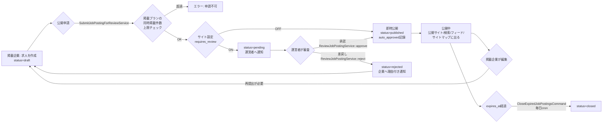

### 4.2 応募フロー(SPEC.md 8.2)

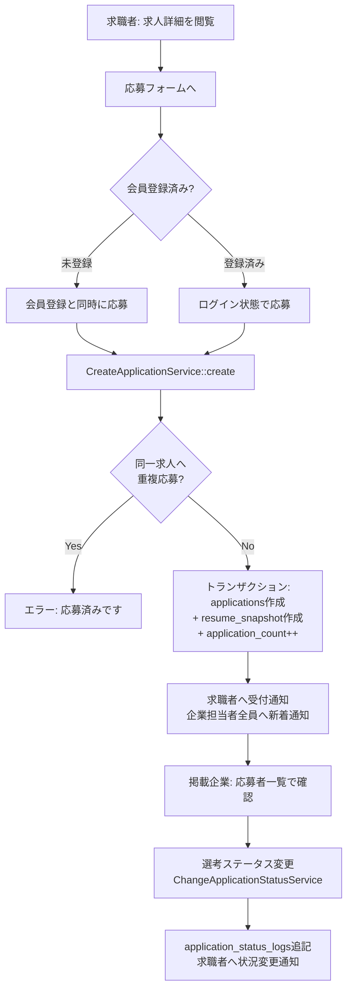

### 4.3 アグリゲーション連携フロー(SPEC.md 10章)

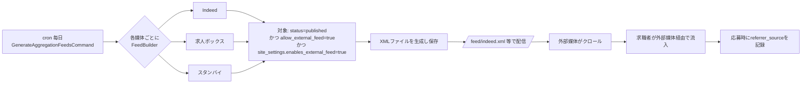

### 4.4 データ返還・完全削除フロー(SPEC.md 13章 / TASKS.md T-17)

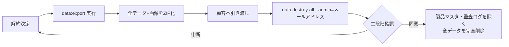

---

## 5. API一覧

REST風のHTTPルート(全て`routes/web.php`。SPA向けAPIではなくBladeのフォーム送信を前提とした画面遷移型)。
`php artisan route:list`で最新を確認できる。

### 5.1 公開メディアサイト(認証不要)

| Method | URI | 名前 | 用途 |
|---|---|---|---|
| GET | `/` | `public.top` | トップページ |
| GET | `/jobs` | `public.jobs.index` | 求人検索・一覧 |
| GET | `/jobs/{job_posting}` | `public.jobs.show` | 求人詳細 |
| GET | `/jobs/{job_posting}/apply` | `public.jobs.apply` | 応募フォーム |
| POST | `/jobs/{job_posting}/apply` | `public.jobs.apply.store` | 応募確定 |
| GET | `/companies/{company}` | `public.companies.show` | 企業紹介ページ |
| GET | `/cities/by-prefecture/{prefecture}` | `cities.by-prefecture` | 都道府県選択時の市区町村Ajax取得(JSON) |
| GET | `/sitemap.xml` | `public.sitemap` | サイトマップ(公開求人のみ) |

### 5.2 アグリゲーションフィード(認証不要)

| Method | URI | 名前 |
|---|---|---|
| GET | `/feed/indeed.xml` | `feed.indeed` |
| GET | `/feed/kyujinbox.xml` | `feed.kyujinbox` |
| GET | `/feed/stanby.xml` | `feed.stanby` |

### 5.3 求職者(`seeker`ガード)

| Method | URI | 名前 |
|---|---|---|
| GET/POST | `/register` | `seeker.register` / `.store` |
| GET/POST | `/login`, POST `/logout` | `seeker.login` 系 |
| GET/POST | `/forgot-password`, `/reset-password` | `seeker.password.*` |
| GET | `/mypage` | `seeker.mypage` |
| GET/PUT | `/profile` | `seeker.profile.edit` / `.update` |
| POST/PUT/DELETE | `/experiences`, `/experiences/{experience}` | `seeker.experiences.*` |
| POST | `/experiences/reorder` | `seeker.experiences.reorder` |
| DELETE | `/account` | `seeker.account.destroy`(退会) |

### 5.4 掲載企業(`company`ガード。URLに企業IDを含めない = CLAUDE.md 3.8)

| Method | URI | 名前 |
|---|---|---|
| GET/POST | `/company/login`, `/company/logout` | `company.login` 系 |
| GET | `/company` | `company.dashboard` |
| GET/PUT | `/company/profile` | `company.profile.*` |
| GET/POST/PUT/DELETE | `/company/workplaces[...]` | `company.workplaces.*` |
| GET/POST/PUT/DELETE | `/company/job-postings[...]` | `company.job-postings.*` |
| POST | `/company/job-postings/{job_posting}/submit` | `company.job-postings.submit`(審査提出) |
| POST | `/company/job-postings/{job_posting}/duplicate` | `company.job-postings.duplicate` |
| GET | `/company/applications`, `/company/applications/export` | `company.applications.index` / `.export`(CSV) |
| GET | `/company/applications/{application}` | `company.applications.show` |
| PUT | `/company/applications/{application}/status` | `company.applications.status.update`(選考ステータス変更) |
| POST/DELETE | `/company/applications/{application}/notes[...]` | `company.applications.notes.*` |

### 5.5 運営者(`admin`ガード)

| Method | URI | 名前 |
|---|---|---|
| GET/POST | `/admin/login`, `/admin/logout` | `admin.login` 系 |
| GET | `/admin` | `admin.dashboard` |
| GET/POST/PUT/DELETE | `/admin/companies[...]` | `admin.companies.*`(代理登録・編集) |
| POST | `/admin/companies/{company}/users[...]` | `admin.companies.users.*`(担当者招待・再送・無効化) |
| GET/POST/PUT/DELETE | `/admin/companies/{company}/workplaces[...]` | `admin.companies.workplaces.*` |
| GET/POST/PUT/DELETE | `/admin/companies/{company}/job-postings[...]` | `admin.companies.job-postings.*`(代行編集) |
| POST | `/admin/companies/{company}/plan-assignments` | `admin.companies.plan-assignments.store` |
| GET | `/admin/reviews` | `admin.reviews.index`(審査待ち一覧) |
| POST | `/admin/job-postings/{job_posting}/approve` \| `/reject` | 審査の承認・差戻し |
| GET/POST/PUT | `/admin/posting-plans[...]` | `admin.posting-plans.*` |
| GET | `/admin/applications` | `admin.applications.index`(応募者横断確認) |
| GET | `/admin/feeds` | `admin.feeds.index`(媒体別効果測定) |
| GET/POST | `/admin/masters`, `/admin/masters/{type}` | `admin.masters.*`(マスタ管理) |
| POST | `/admin/masters/{type}/reorder` \| `/{id}/toggle` | 並び替え・有効無効切替 |
| GET/PUT | `/admin/site-settings` | `admin.site-settings.*` |
| GET | `/admin/audit-logs` | `admin.audit-logs.index` |

---

## 6. バッチ一覧

`routes/console.php`で毎日スケジュール登録済み(cronから毎分`schedule:run`を実行する前提)。

| コマンド | 実行間隔 | 内容 |
|---|---|---|
| `job-postings:close-expired` | 毎日 | 掲載期限(`expires_at`)を過ぎた公開中の求人を`closed`にする |
| `feeds:generate` | 毎日 | Indeed/求人ボックス/スタンバイ向けXMLフィードを生成する(チャンク処理) |

手動実行専用コマンド(スケジュール未登録):

| コマンド | 用途 |
|---|---|
| `data:export` | 全データ(掲載企業・事業所・求人・応募・会員)と画像をZIPにエクスポート(解約時のデータ返還) |
| `data:destroy-all --admin=<email>` | 解約時に全データ(製品マスタ・監査ログを除く)を完全削除。二段階確認が必要。**取り消せない** |
| `masters:build-city-data` | 総務省の Excel から `database/data/cities.php` を生成する(開発用) |

キューワーカー(常駐プロセス代替):

```
php artisan queue:work --stop-when-empty --max-time=50   # cronから毎分実行
```

通知(応募受付・新着応募・審査結果・審査待ち・担当者招待)はキュー経由のため、**最大1分の遅延**が仕様として許容される。

---

## 7. クラス図

### 7.1 Eloquentモデルの関連

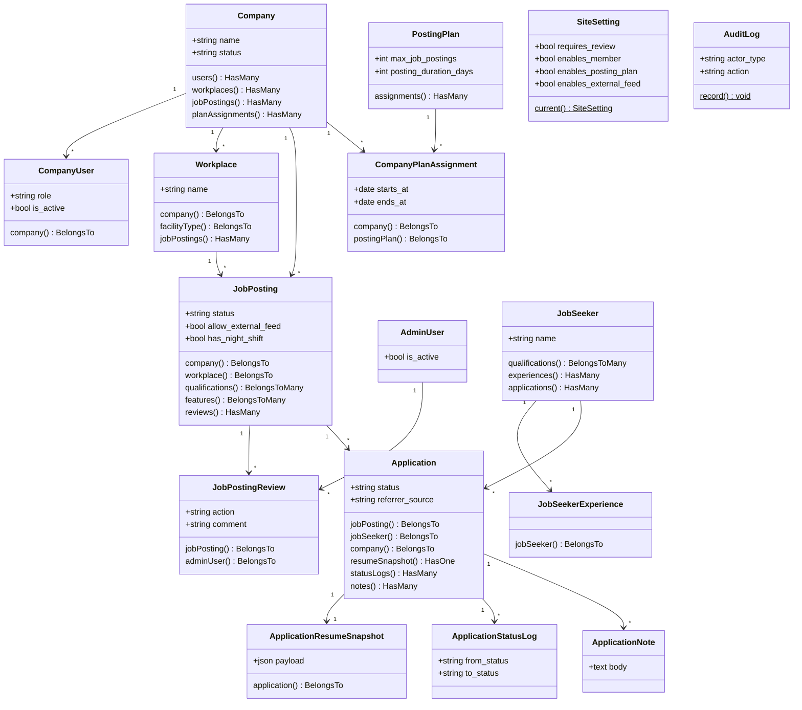

### 7.2 主要サービス層

```mermaid
classDiagram
    class SubmitJobPostingForReviewService {
        +submit(JobPosting) JobPosting
    }
    class ReviewJobPostingService {
        +approve(JobPosting, AdminUser) JobPosting
        +reject(JobPosting, AdminUser, reason) JobPosting
    }
    class PostingPlanLimitService {
        +canSubmitJobPosting(Company, excluding) bool
        +publishAttributes(Company) array
    }
    class CreateApplicationService {
        +create(JobSeeker, JobPosting, message, referrerSource) Application
    }
    class ChangeApplicationStatusService {
        +change(Application, status, CompanyUser) Application
    }
    class ApplicationSearchService
    class ApplicationCsvExporter
    class JobPostingSearchService
    class JobPostingJsonLd
    class ImageUploadService {
        +supportsWebp()$ bool
        +store(UploadedFile) string
    }
    class InviteCompanyUserService
    class ReferrerSourceResolver
    class FeedBuilder {
        <<interface>>
        +build() string
    }
    class AbstractFeedBuilder
    class IndeedFeedBuilder
    class KyujinboxFeedBuilder
    class StanbyFeedBuilder
    class FeedMetaStore
    class ThemeManager {
        +view(string) string
        +assetUrl(string) string
        +installedThemes() array
    }

    SubmitJobPostingForReviewService --> PostingPlanLimitService
    ReviewJobPostingService --> PostingPlanLimitService
    AbstractFeedBuilder ..|> FeedBuilder
    IndeedFeedBuilder --|> AbstractFeedBuilder
    KyujinboxFeedBuilder --|> AbstractFeedBuilder
    StanbyFeedBuilder --|> AbstractFeedBuilder
    AbstractFeedBuilder --> FeedMetaStore
```

### 7.3 コントローラの委譲パターン(CLAUDE.md 3.9)

同じCRUDロジックを運営者(代行編集)と掲載企業(自社編集)で共有するため、
公開アクションは各コントローラでルートのURL順に引数を定義し、実処理だけをトレイトの`protected`メソッドへ委譲する。

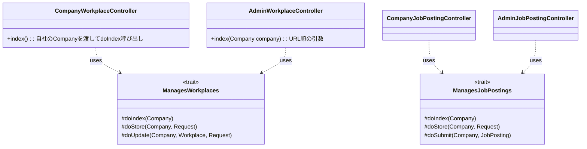

---

## 8. シーケンス図

### 8.1 求人審査(承認)フロー

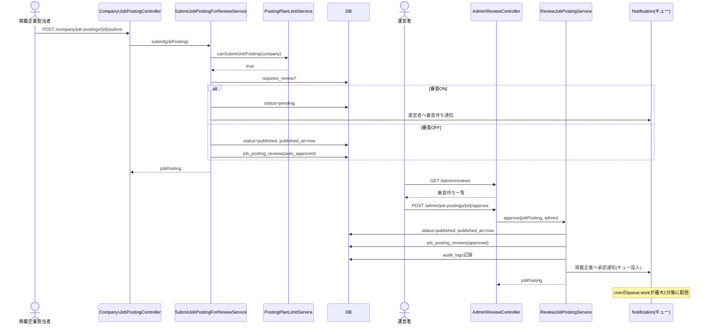

### 8.2 応募フロー

```mermaid
sequenceDiagram
    actor Seeker as 求職者
    participant PC as Public\ApplicationController
    participant Create as CreateApplicationService
    participant DB
    participant Notify as Notification(キュー)
    actor CompanyUser as 掲載企業担当者

    Seeker->>PC: GET /jobs/{job_posting}/apply
    PC-->>Seeker: 応募フォーム(未ログインなら会員登録も同時に)
    Seeker->>PC: POST /jobs/{job_posting}/apply
    PC->>Create: create(jobSeeker, jobPosting, message, referrerSource)
    Create->>DB: 重複応募チェック
    alt 既に応募済み
        Create-->>PC: ValidationException
        PC-->>Seeker: エラー表示
    else 未応募
        Create->>DB: BEGIN TRANSACTION
        Create->>DB: applications作成
        Create->>DB: application_resume_snapshots作成(payload=JSON)
        Create->>DB: job_postings.application_count++
        Create->>DB: COMMIT
        Create->>Notify: 求職者へ受付通知
        Create->>Notify: 企業担当者全員へ新着応募通知
        Create-->>PC: application
        PC-->>Seeker: 応募完了画面
    end

    CompanyUser->>PC: (別リクエスト) GET /company/applications
    Note over CompanyUser,DB: 表示するのは application_resume_snapshots のみ。job_seekers を直接参照しない
```

### 8.3 選考ステータス変更フロー

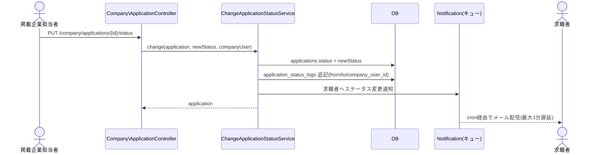

### 8.4 アグリゲーションフィード生成(日次バッチ)

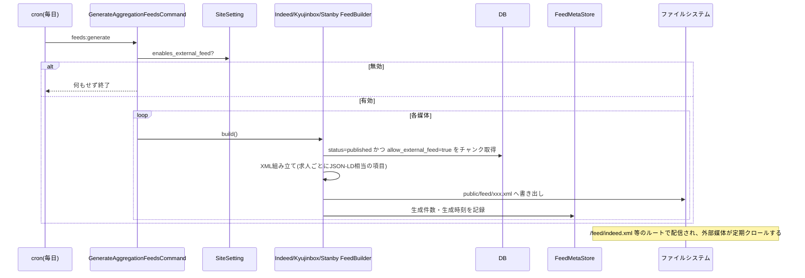

---

## 9. ER図

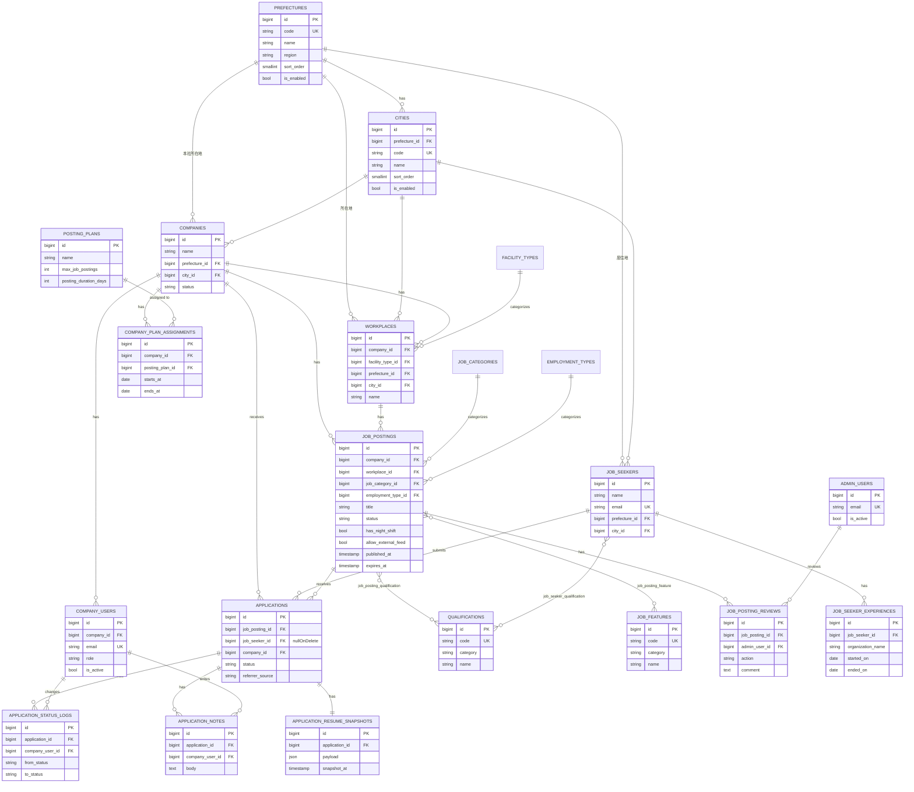

> `site_settings`(1行のみ)と`audit_logs`(ポリモーフィックでFK制約なし)はER図上の結合関係を持たないため上図からは省略。

---

## 10. 画面一覧

`resources/views/core/`配下(コア標準テンプレート)。テーマ(`resources/views/themes/{name}/`)は
同じパス構造で差分ファイルを置くと優先的に読み込まれる(`ThemeManager`によるフォールバック解決)。

### 10.1 公開メディアサイト(認証不要・SEO対象)

| 画面 | Blade | 対応ルート |
|---|---|---|
| トップページ | `public/top.blade.php` | `public.top` |
| 求人検索・一覧 | `public/jobs/index.blade.php` | `public.jobs.index` |
| 求人詳細 | `public/jobs/show.blade.php` | `public.jobs.show` |
| 応募フォーム | `public/jobs/apply.blade.php` | `public.jobs.apply` |
| 企業紹介ページ | `public/companies/show.blade.php` | `public.companies.show` |

### 10.2 求職者マイページ(`seeker`ガード)

| 画面 | Blade | 対応ルート |
|---|---|---|
| 会員登録 | `seeker/auth/register.blade.php` | `seeker.register` |
| ログイン | `seeker/auth/login.blade.php` | `seeker.login` |
| パスワード再設定申請/実行 | `seeker/auth/forgot-password.blade.php` / `reset-password.blade.php` | `seeker.password.*` |
| マイページ(応募履歴) | `seeker/mypage.blade.php` | `seeker.mypage` |
| プロフィール編集(保有資格・職務経歴含む) | `seeker/profile/edit.blade.php` | `seeker.profile.edit` |

### 10.3 掲載企業の管理画面(`company`ガード)

| 画面 | Blade | 対応ルート |
|---|---|---|
| ログイン / パスワード再設定 | `company/auth/*.blade.php` | `company.login` 系 |
| ダッシュボード | `company/dashboard.blade.php` | `company.dashboard` |
| 自社プロフィール編集 | `company/profile/edit.blade.php` | `company.profile.edit` |
| 事業所一覧・作成・編集 | `company/workplaces/{index,create,edit}.blade.php` | `company.workplaces.*` |
| 求人一覧・作成・編集 | `company/job-postings/{index,create,edit}.blade.php` | `company.job-postings.*` |
| 応募者一覧・詳細(選考ステータス変更・メモ・CSV出力) | `company/applications/{index,show}.blade.php` | `company.applications.*` |

### 10.4 運営者の管理画面(`admin`ガード)

| 画面 | Blade | 対応ルート |
|---|---|---|
| ログイン / パスワード再設定 | `admin/auth/*.blade.php` | `admin.login` 系 |
| ダッシュボード | `admin/dashboard.blade.php` | `admin.dashboard` |
| 掲載企業一覧・作成・編集・詳細 | `admin/companies/{index,create,edit,show}.blade.php` | `admin.companies.*` |
| 掲載企業の代行:事業所管理 | `admin/workplaces/{index,create,edit}.blade.php` | `admin.companies.workplaces.*` |
| 掲載企業の代行:求人管理 | `admin/job-postings/{index,create,edit}.blade.php` | `admin.companies.job-postings.*` |
| 審査待ち一覧(承認・差戻し) | `admin/reviews/index.blade.php` | `admin.reviews.index` |
| 掲載プラン一覧・作成・編集 | `admin/posting-plans/{index,create,edit}.blade.php` | `admin.posting-plans.*` |
| 応募者横断確認 | `admin/applications/index.blade.php` | `admin.applications.index` |
| アグリゲーション媒体別効果 | `admin/feeds/index.blade.php` | `admin.feeds.index` |
| マスタ管理(ホーム・種別ごと) | `admin/masters/{home,index}.blade.php` | `admin.masters.*` |
| サイト設定 | `admin/site-settings/edit.blade.php` | `admin.site-settings.edit` |
| 監査ログ閲覧 | `admin/audit-logs/index.blade.php` | `admin.audit-logs.index` |

### 10.5 共通レイアウト・コンポーネント

| 用途 | Blade |
|---|---|
| 公開サイト共通レイアウト(ヘッダー・フッター) | `layouts/app.blade.php` `layouts/header.blade.php` `layouts/footer.blade.php` |
| 管理画面共通レイアウト(サイドバー・KPIパネル) | `layouts/manage.blade.php` |
| 求人カード / ステータスバッジ(求人・応募・企業) | `components/job-posting-card.blade.php` 等 |
| フォーム部品(input/select/textarea/checkbox-group) | `components/form/*.blade.php` |
| 都道府県→市区町村の動的選択(Ajax) | `components/prefecture-city-select-script.blade.php` |
| 認証フォーム共通部品 | `components/auth-*.blade.php` |

---

## 参考ドキュメント

- ビジネス要件・機能仕様: [SPEC.md](../SPEC.md)
- 実装ルール・絶対ルール: [CLAUDE.md](../CLAUDE.md)
- 作業履歴・完了条件: [TASKS.md](../TASKS.md)
- 環境構築・デプロイ手順: [新規環境の構築手順.md](新規環境の構築手順.md) / [デプロイ手順.md](デプロイ手順.md)
- 導入済み環境の一覧: [環境台帳.md](環境台帳.md)
